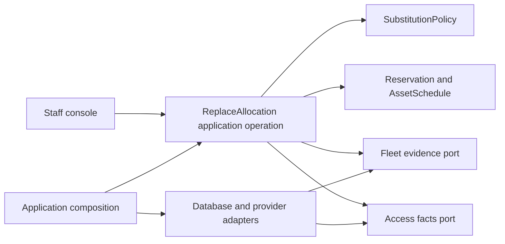

# Northbank allocation: from service promise to code change

In [Northbank's episode D](../northbank-equipment.md#related-episodes-not-one-oversized-project),
a later investment follows the small confirmation pilot. Customers buy an
agreed capability for a period; the original machine can fail. The team wants
authorized substitutions that preserve the agreement and do not double-allocate
equipment. This is an invented, bounded design, not general architecture guidance.

The [requirement specimens](../solution/requirements/authoring/northbank-commitment-requirements.md)
own the rules referenced here. The worked operation covers one reservation
line and Northbank-owned assets under one controlled persistence boundary.
Partner capacity and multi-machine requests need additional decisions.

## Discover the responsibility inside the code

The initial `booking-service.ts` reads `Equipment.available`, chooses a
substitute, assigns its ID, and sends confirmation. Staff-access code contains
part of the substitution rule. A shared identifier file declares every
domain's IDs. These fictional findings expose questions before they establish
an extraction plan:

- Does `available` mean inspected and ready now, or uncommitted next week?
- Which agreed constraints make a candidate acceptable?
- Who owns all writes that can allocate the same asset?
- Does a failed replacement preserve truthful state?

The answers locate responsibilities. They do not follow from file size or
the word `core` in a package name.

| Before | After | Why the change matters |
| --- | --- | --- |
| `auth/staff-actions.ts` decides acceptable machines | `rental-operations/substitution-policy.ts` | Access facts and domain judgment can change independently |
| `fleet/availability.ts` supplies an unqualified Boolean | Fleet readiness translation and a reservable-capacity query | Ready now and promiseable later remain different judgments |
| `booking-service.ts` assigns IDs directly | `replace-allocation.ts`, `reservation.ts`, `asset-schedule.ts` | The accepted operation has explicit state, invariants, and failure semantics |
| Global `ids.ts` declares every domain identity | Generic ID mechanism with domain IDs beside their owners | Reuse no longer centralizes unrelated meaning |
| Notification emitted before durable change | Committed occurrence and pending publication recorded together | A failed transaction cannot announce a replacement that never happened |

## Model boundaries and implementation boundaries

Rental Operations owns commitments and allocation. Fleet Readiness owns the
release judgment for handover; Billing owns financial meaning; Identity/Access
supplies identity and permission facts. Translation protects local meaning at
provider boundaries. These model boundaries do not require separate processes.



This view shows collaboration and composition. It is not a Wardley map, and
its arrows do not classify subdomains. An import graph is a separate view:
domain behavior must not import the concrete provider or deployment root;
composition supplies their adapters. Package exports and dependency rules can
help enforce that chosen architecture, but cannot establish coherent meaning.

## Express the domain decision

`SubstitutionPolicy` asks whether the candidate preserves the agreed terms.
It does not reserve capacity, authenticate a user, or certify equipment safety.
The following TypeScript-shaped fragment shows intent using simplified,
pre-normalized attributes. It is illustrative code, not a complete equipment
model or an implementation of every requirement:

```typescript
type Terms = {
  substitutionAllowed: boolean;
  requiredAttributes: Readonly<Record<string, string>>;
};
type Candidate = {
  attributes: Readonly<Record<string, string>>;
};
type Decision =
  | { kind: "eligible" }
  | { kind: "rejected"; reason: string };

function assessSubstitution(terms: Terms, candidate: Candidate): Decision {
  if (!terms.substitutionAllowed) {
    return { kind: "rejected", reason: "Customer agreement prohibits substitution" };
  }
  for (const [attribute, required] of Object.entries(terms.requiredAttributes)) {
    if (candidate.attributes[attribute] !== required) {
      return { kind: "rejected", reason: `Unmet agreed constraint: ${attribute}` };
    }
  }
  return { kind: "eligible" };
}
```

An eligible result permits an allocation attempt; it does not establish
capacity or readiness. A production model may need units, ranges, compatibility
rules, and expert-approved constraints rather than exact string matching.
The value of the fragment is that a domain question is independently visible
and testable. Renaming a procedural helper `Policy` would not accomplish that.

The `Reservation` preserves identity and terms. `AssetSchedule` protects
allocations and holds for one asset over the declared horizon. `RentalPeriod`
uses the agreed interval semantics. A cancelled reservation cannot be made
confirmed by changing its assignment.

## Make the consistency choice explicit

For this local-storage design, one transaction changes the reservation and the
two affected schedules. That is a deliberate exception to a default preference
for one aggregate per transaction. It trades concurrency and contention for a
small, explicit atomic replacement boundary.

```text
replaceAllocation(request):
  obtain actor permission and candidate capability evidence
  begin transaction
    claim the durable operation identity; compare inputs on replay
    lock reservation; verify expected revision and eligible state
    lock affected asset schedules in stable asset-ID order
    evaluate substitution against the reservation's accepted terms
    reject if replacement has an overlapping active allocation or live hold
    atomically release old allocation, secure new one, and update assignment
    persist operation result and pending publication
  commit
  deliver the committed occurrence through the publication worker
```

Every allocation/hold writer in this scope must use the same schedule locking
discipline; otherwise the check is not protected. The operation-identity
constraint prevents two concurrent executions of the same request. The same
asset requested as its own replacement is a no-op with a recorded result.
Expiry comparisons use one transaction's time basis. Conflicts abort; retry
reloads current state rather than replaying stale decisions. Domain conflicts
can be recorded as terminal outcomes under the operation identity; a failed
transaction itself cannot persist a success result.

These are implementation choices requiring evidence. The prose and diagram
do not provide database isolation. If other writers cannot be controlled,
this design cannot claim `NB-ALLOC-01`; the pilot needs a different scope or
allocation mechanism.

Fleet evidence can become stale and is not made atomic by this transaction.
Fleet Readiness still controls handover, and new evidence can put fulfillment
at risk. Payment and partner calls also remain outside the transaction. Their
unknown outcomes need durable attempts, reconciliation, hold expiry, and
explicit customer states. Adding a queue does not decide those obligations.

## Choose evidence that can contradict the claims

| Claim | Evidence world | Contrary condition that must be visible |
| --- | --- | --- |
| Agreed constraints decide admissibility | Plain policy inputs/results | A superficially better but incompatible candidate is accepted |
| No overlapping allocation | Competing commands through the application against the real store | Both commands commit for one asset and overlapping period |
| Atomic replacement | Conflict and interruption at persistence boundaries | Assignment changes while the new allocation is absent |
| Replay preserves one effect | Same operation identity, concurrent/repeated requests | Two replacements or inconsistent results |
| Publication follows commitment | Durable publication with interruption and redelivery | Uncommitted replacement announced, or duplicate consumer effect |
| Staff understand current state | Representative staff/contractor scenarios and selected real-browser interactions | Pending or withdrawn state is interpreted as a valid promise |

The first row belongs at the narrow level; store isolation needs the real
boundary. Browser evidence earns its place through interaction risk, not
because the operation has a screen. A fake with sequential behavior cannot
prove concurrency. Results identify revision, inputs, environment, and limits;
the table is an evidence plan, not a passing result.

## Move existing commitments safely

First inventory the writers and the agreements already made. Resolve the
access/policy cycle before extracting packages. Introduce the new representation
and backfill only supported facts. Preserve named-machine terms and isolate
ambiguous records for explicit resolution.

Move one controlled cohort to the new writer and reconcile its allocations and
holds. Disable competing old writes for that inventory before admitting new
operations. Exercise failures and staff procedure before expanding. Retire old
read/write paths after their consumers and obligations are accounted for.

Rollback concerns records and promises as well as binaries. If the old reader
cannot interpret new assignments, reverting an application is insufficient.
The release decision must identify compatible readers, write suspension,
reconciliation, and when a forward correction is required. The
[engineering-system episode](northbank-engineering-system.md) connects those
obligations to tasks, artifacts, CI/CD, and infrastructure.

## Return to the product question

The change makes a rule and its enforcement inspectable. It does not prove
that Northbank has enough reserve equipment, that dispatch can deliver it, or
that contractors will return. Conversely, a conflict exposed by a database
experiment can show that the selected service promise needs a narrower pilot.
[Outcomes and evidence](../problem/outcomes-and-evidence.md) examines the
remaining customer and business claims; [DDD](../foundations/domain-driven-design.md)
explains the modeling concepts behind this particular design.
