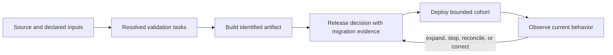

# Northbank engineering: tooling, delivery, and infrastructure

[Northbank Equipment](../northbank-equipment.md) needs to change a rental
product people already depend on. Its engineers maintain custom boundary
checks, repeated validation lists, and runtime plumbing that once filled gaps.
Episode E asks which responsibilities still require that machinery and how to
replace it without losing its guarantees. All observations and choices here
are fictional; this is a worked case, not a vendor recipe.

## Start from the product and the engineering need

The [allocation change](northbank-allocation-change.md) must preserve customer
terms, exclude conflicting allocations, and support recovery. To deliver it,
engineers need trustworthy checks, an identifiable artifact, compatible data,
and a controlled rollout. These are engineering-system capabilities with
consequences for the product; they are not additional product-quality pillars.

Two viewpoints help locate investment:

| View | User and need | Dependencies to examine |
| --- | --- | --- |
| Product landscape | Contractor keeping a crew working | Committed capability, substitution, prepared equipment, transport, staff, fleet records, storage/compute |
| Engineering landscape | Team changing and releasing dependable behavior | Owned rules, tests, package boundaries, build, artifact storage, migration, deployment, telemetry, recovery |

For the fictional landscape, assume routine fleet records and build tooling
have established product alternatives, compute/storage provision is available
as a utility, local substitution policy requires custom work, and automatic
recovery recommendations remain an uncertain experiment. These assumptions
support a discussion; they are not market findings. A provider offering does
not prove its fit for Northbank's required behavior.

DDD asks whether particular business knowledge differentiates Northbank.
Wardley mapping asks about a component's characteristics and evolution.
Dependency direction asks which implementation may know about another.
Build tooling is an engineering capability, not a generic subdomain merely
because many companies use it. The views should correspond without merging.

## Resolve ownership before moving directories

The baseline package has a cycle: staff-access code owns substitution decisions,
while booking code calls staff-access to perform replacements. A boundary script
reports the cycle but permits exceptions. Moving both directories to packages
would preserve the underlying problem.

Move admissibility rules to Rental Operations, expose access facts through a
port, and let application composition supply the adapter. Move identifiers
with the meanings they identify; keep only the ID mechanism generic. Review
public exports and consumers before extracting packages.

```text
packages/
  rental-operations/     reservation, schedules, substitution, replacement
  fleet-integration/    translation of provider readiness/catalog evidence
  billing/              financial records and document data
  document-rendering/   receipts from committed data
  access/               identity and permission facts
  runtime/              application composition and lifecycle
tools/                  build and test presets
deployment/             runtime, infrastructure, and rollout configuration
```

This is one proposed package arrangement. Rental Operations can contain several
modules; the provider context is not defined by the `fleet-integration` package.
No package must be separately deployed. Classification as core, supporting,
or generic is not an automatic import-order rule.

## Replace a mechanism only after its obligation is covered

| Existing mechanism | Proposed action | Distinct property to demonstrate |
| --- | --- | --- |
| Directory boundary checker and exception list | Replace covered checks with public exports, declared dependencies, compiler/build checks, and established lint rules | Forbidden imports/cycles are rejected through supported consumption paths; legitimate consumers build |
| Two scripts, hook, and CI each list validation members | Establish one resolved membership authority; callers invoke its supported intent | A required new allocation-integration check cannot be omitted by one caller's copied list |
| Repeated build/test configuration | Use adopted inference or shared configuration where semantics match | Inputs, generated prerequisites, outputs, and test results remain correct |
| Custom telemetry draining | Trial the adopted runtime's lifecycle facility under Northbank's worker model | Committed telemetry drains on actual shutdown/failure paths within the declared resource budget |
| Domain substitution and access checks | Retain with the owning rule | General tooling cannot establish customer-specific admissibility or authorization |

The comparison preserves an explicit keep decision. A wrapper can have useful
behavior, an adapter can protect a model, and a custom check can enforce an
uncovered obligation. Fewer lines and fewer tools are not sufficient results.
If the lifecycle experiment fails, retain the current drain mechanism with
the failed condition and a reconsideration trigger.

## Give tasks one observable meaning

Suppose local verification includes a new allocation-concurrency suite but
CI's copied list omits it. Both commands print success. The defect is in what
the caller thinks success establishes.

Use the [repository task interface](repository-task-interface.md) to define
the supported intents. The following names describe the fictional contract;
they are not commands for a particular runner.

| Intent | Prerequisites and outputs | Result and replay meaning |
| --- | --- | --- |
| Source validation | Declared source/configuration and generated dependencies; lint/type/policy results | Evidence for that input identity; accurate cache inputs and trusted artifacts required |
| Allocation integration | Representative real store, schema, isolated test state; recorded outcomes | Evidence for concurrency and failure in that environment; a stale live dependency cannot be hidden by replay |
| Artifact build | Valid declared inputs and build toolchain; identifiable deployable artifact | Cached output must restore the full artifact and retain provenance |
| Migration rehearsal | Representative old histories and target schema; reconciliation report | Establishes behavior for the included histories, not unseen production data |
| Deployed smoke assessment | Identified deployed artifact and current environment; bounded observations | Current execution; a historical build cache hit cannot prove live health |

A supported task works from a clean shell once declared prerequisites are met.
Wrappers forward the supported arguments or reject them explicitly. A hook can
invoke a deliberately smaller intent; it cannot call that result full release
evidence. Privileged deployment and mutating migration tasks are not replayed
from a result cache.

The completed change should make one deliberate failure observable: arrange
for the required allocation assessment to fail and confirm that the intended
validation workflow fails. Inspect the resolved task membership as well.
Testing only that a YAML file contains a task name would miss the original
semantic problem. [Task conformance](task-invocation-and-conformance-principles.md)
develops the distinction.

## Separate task contracts from delivery orchestration

CI/CD chooses when to invoke tasks, under what privileges, and what happens to
the results. It constructs an artifact once and identifies the promoted object
alongside the source revision, relevant configuration, and evidence. Source
success is not evidence that production runs that artifact.



Each arrow has a different meaning from a code import. The release decision
needs readiness evidence, unresolved conditions, and a recovery path. The
workflow may invoke the same tasks locally and in CI without making the
environment or privilege boundaries identical.

## Make infrastructure obligations visible

| Runtime element | Responsibility | Failure that the design must confront |
| --- | --- | --- |
| Transactional store | Allocation ownership, operation identity, customer terms, pending publication | Competing writers, interrupted commit, incompatible schema |
| Publication/receipt queue | Durable work with retry and observable backlog | Lost acknowledgment, duplicate delivery, poison work, stalled processing |
| Document worker | Render committed financial data | Resource accumulation and correlated failures; retry must not charge again |
| Fleet/payment adapters | Translate external meaning and record uncertainty | Stale data, unknown authorization outcome, changed provider contract |
| Runtime composition | Supply configuration, access, lifecycle, and dependency instances | Incorrect privileges or disposal can break an otherwise valid application |
| Telemetry and support | Detect and interpret effects with attributable evidence | Missing events, misleading health, and unowned alerts |

The product need does not determine a cloud vendor. A choice of managed storage
still leaves schema, access, recovery, and cost responsibilities. A queue does
not grant exactly-once financial effects. Provider substitution must examine
semantics, compatibility, migration, operations, and economics together.

## Deliver the change and retire what it replaced

The migration obligation `NB-MIGRATE-01` is stated in the
[requirement specimen](../solution/requirements/authoring/northbank-commitment-requirements.md).
The implementation sequence is:

1. Identify actual writers and consumers, including staff procedures. Record
   which obligations each old check or adapter currently supports.
2. Resolve mixed ownership and cycles inside the existing package.
3. Introduce public interfaces and replacement enforcement; challenge the
   intended boundaries before deleting the old checker.
4. Rehearse the data change against representative histories. Preserve
   named-machine terms and route ambiguous records to explicit resolution.
5. Move one cohort to one allocation writer. Reconcile holds and assignments,
   then deploy the identified artifact and inspect current behavior.
6. Expand only within the accepted scope and evidence. Remove obsolete writers,
   exceptions, scripts, credentials, and deployment configuration when their
   consumers and obligations have moved.

Reverting a binary does not undo a new customer commitment or provider effect.
Name compatible readers and whether recovery requires stopping writes,
reconciliation, or a forward correction. Deleting the legacy path before this
is understood could remove the only means of recovery.

## Assess the result at the right subject

Record whether maintainers can add a check in one place, identify what a
successful invocation proves, and perform the next representative rule change
without editing unrelated policy. Observe task duration and maintenance effort
under comparable conditions; do not invent savings from the deletion count.

Within [codebase review](codebase-review/index.md), structure and lifecycle
integrity can support product judgments. Test-suite quality is an assessment
of supporting evidence, and delivery capability concerns the engineering
system. None is automatically a verdict on product correctness or customer
value. [Maintenance](../maintenance/maintenance-and-the-life-of-software-products.md)
asks whether the intervention and continued upkeep remain worthwhile.
