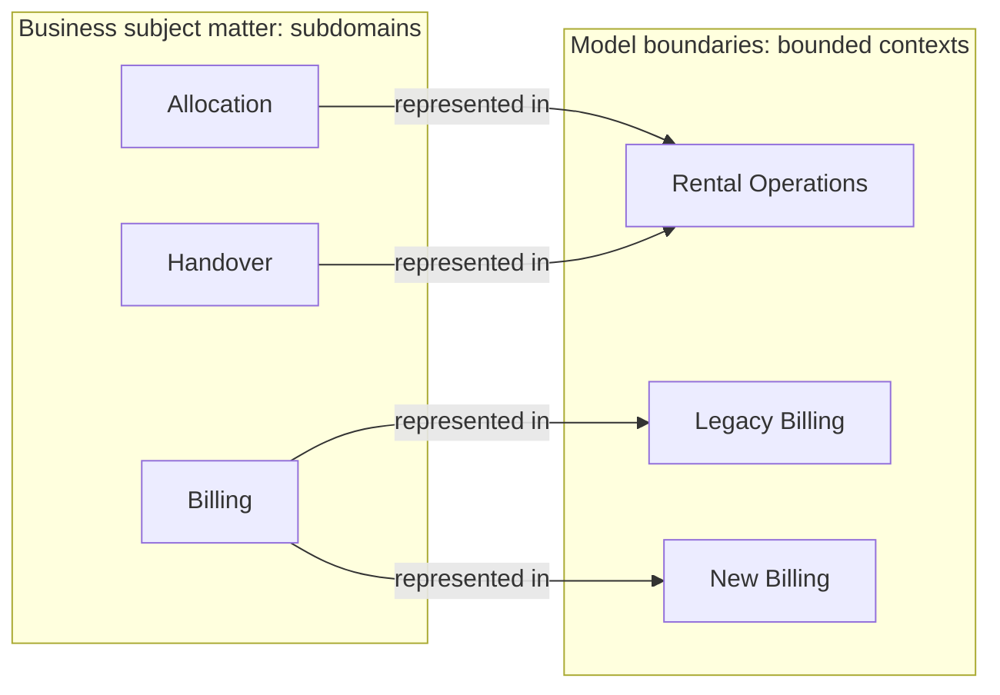
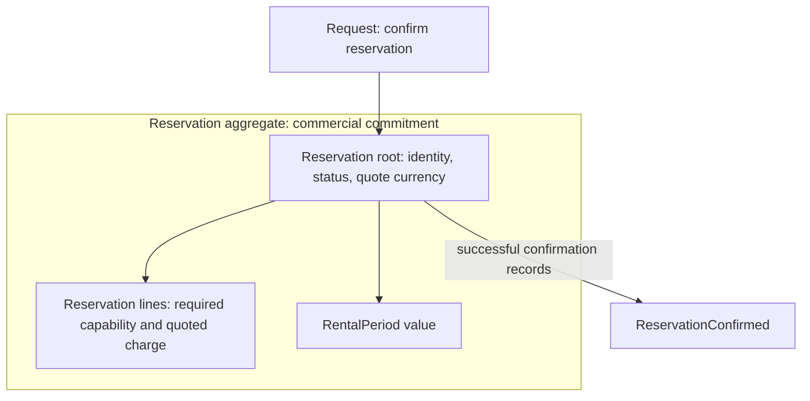

# Domain-driven design

Domain-driven design (DDD) is an approach to developing software in which
understanding the domain, designing a useful model, and expressing that model
in software are continuing, connected activities. It focuses attention on the
domain's strategically important problems and brings domain experts and
developers together to work in a shared language. Explicit model boundaries
allow different parts of a system to represent the world differently without
silently confusing their meanings.[^evans-reference]

This explanation is for developers, architects, and product practitioners who
want to understand DDD's concepts and how they fit together. It covers strategic
design, tactical design, discovery, and evolution. The examples are invented
to illustrate modeling choices; they are not evidence that a particular design
works for every rental business.

For behavior that can expose domain questions, read [Use cases](use-cases.md).
A reservation's success and failure paths can reveal distinctions the model
needs to express; they do not determine its boundaries.

## Foundations: domain, model, and language

A **domain** is the subject area being considered: equipment rental, insurance
underwriting, or shipment planning. A **subdomain** is an area within a broader
domain. The relationship is relative: fleet management can be a subdomain of
equipment rental and itself contain maintenance and allocation subdomains.
Domains organize the knowledge and activities we need to understand.

A **domain model** selects concepts, relationships, rules, and behavior useful
for a purpose. It leaves things out. A model of rental commitments might care
about periods, reservations, and substitution rights, while a maintenance model
cares about inspections and repairs. Both can describe the same equipment
without needing the same representation.[^evans-reference]

**Domain experts** contribute knowledge of how the activity actually works,
including exceptions and competing interpretations. Developers contribute
questions about precision, behavior, and implementability. Neither contribution
is sufficient alone. A model must help people reason about the domain and be
expressible in working software.

The **ubiquitous language** is the language used by those collaborators within
a **bounded context**, the boundary where a particular model applies. It
includes operations, rules, and relationships as well as nouns. Agreement on
the word “reservation” is weak if people disagree about whether a reservation
guarantees a particular machine. Sentences such as “a confirmed reservation
guarantees equipment of this capability for this period” expose the model's
actual commitments.[^evans-reference]

In **model-driven design**, the model shapes code names, responsibilities, and
behavior; implementation experience also changes the model. Diagrams and
glossaries help communicate it, but their value depends on correspondence with
the language and behavior people use. A diagram that describes one model while
the software implements another cannot guide a change reliably.

Two scales of design work together:

| Scale | Main concerns | Connection to the other scale |
| --- | --- | --- |
| Strategic design | Domain importance, model boundaries, and relationships between contexts and teams | Gives tactical modeling a purpose and a scope |
| Tactical design | Identity, values, behavior, invariants, and object lifecycle within a context | Reveals whether the proposed boundaries and concepts can support real scenarios |

These are scales of reasoning, not consecutive project phases. A transactional
problem inside an aggregate can reveal that the larger model needs to change.

### Running example: equipment rental

[Northbank Equipment](../northbank-equipment.md), the fictional business in
this bundle, competes on fulfilling bookings when equipment breaks or demand
changes. Its distinctive capability is finding acceptable substitutes
and allocating them without breaking customer commitments. It also needs staff
handover procedures, equipment maintenance, invoicing, and authentication.

The word **available** already raises a modeling question. Booking staff may
mean “can be promised for next week”; depot staff may mean “has passed its
inspection and can leave now.” Treating both as one Boolean hides two different
judgments. DDD provides a vocabulary for investigating that difference and
deciding where each meaning belongs.

## Domain discovery and collaborative modeling

**Knowledge crunching** is the work of questioning, comparing, and refining
domain understanding through concrete scenarios. Experts may know their own
work well while holding different views of the whole process. Modeling makes
those differences discussable. Developers participate in the conversation and
bring implementation discoveries back to it.[^evans-reference]

In the rental example, “equipment can be reserved” becomes more informative
when someone asks what happens if the original machine fails. The answer may
introduce an implicit concept: the promise concerns a capability, while the
assignment of a physical asset can change. **Making implicit concepts explicit**
turns a special-case workaround into something the model can express.

The language develops through this work. Terms are tried in scenarios,
challenged by counterexamples, and changed in discussions and code together.
An established business term may need clarification; a technical invention may
need to be abandoned because domain practitioners cannot use it meaningfully.

Several techniques support the conversation:

| Technique | What it makes visible | Role in the rental example |
| --- | --- | --- |
| EventStorming | Business activity explored through significant events, with different formats for broad discovery and detailed design | Exposes what happens between request, confirmation, breakdown, substitution, and return |
| Domain Storytelling | Concrete stories about actors, activities, and work items, drawn while experts explain them | Shows how booking staff, depot staff, and customers coordinate a handover |
| Example Mapping | Rules, examples, and unanswered questions around a story | Separates known substitution rules from cases nobody can yet decide |

These techniques have different scopes and can complement one another. Their
creators' material provides the method details; a workshop output is an input
to further understanding and design.[^eventstorming][^storytelling][^example-mapping]

DDD Crew treats discovery as continuous and allows definition and coding to
overlap. Its process is useful as a map of activities, without requiring that
every project follow one fixed order.[^discovery]

## Strategic design: subdomains and classification

### Decomposing a domain

Subdomains help people reason about related capabilities and knowledge at a
manageable scope. In the example, allocation, maintenance, handover, and billing
are plausible areas to examine. Naming a subdomain is an analytical choice:
the useful granularity depends on the decision. “Rental operations” may be
sufficient for an investment discussion and too broad for a discussion of
allocation rules.

### Core, supporting, and generic subdomains

The classification expresses a subdomain's role for a particular organization
and strategy. It directs attention and investment; it is not a ranking of how
essential the capability is to keeping the business running.

| Classification | Defining consideration | Evidence to examine | Usual design implication |
| --- | --- | --- | --- |
| **Core** | Distinctive capability materially contributes to strategic advantage | How doing this differently wins business or enables a distinctive offering; which knowledge or rules create that difference | Protect and deepen the differentiating model; retain the expertise needed to evolve it |
| **Supporting** | Necessary capability has specific needs but little strategic differentiation | Why the work is needed and which requirements are peculiar to the operation | Meet the requirements with proportionate custom work or adaptation |
| **Generic** | The problem is broadly shared and established approaches can meet the relevant needs | Fit of available products, standards, and reusable models; whether adopting one preserves the intended advantage | Evaluate reuse, purchase, or outsourcing rather than automatically designing a specialized model |

This table synthesizes the strategic emphasis on the core with the common
three-category terminology. Khononov's classification essay explains the
categories through differentiation and available solutions, and uses business
complexity as a strong heuristic. He explicitly presents that formulation as
his interpretation.[^khononov-classification]

### Classification criteria and their limits

The primary question in this explanation is **what makes the capability
strategically distinctive**. Complexity, change frequency, market alternatives,
and specialist knowledge inform that judgment. They do not settle it on their
own. DDD Crew's Core Domain Charts separates complexity from differentiation
and encourages discussion of the assumptions behind both assessments. It also
distinguishes essential domain complexity, accidental technical complexity,
and operational complexity.[^core-domain-charts]

For the rental company, substitution and allocation may be core because they
make its fulfillment promise possible. A custom depot handover procedure may
be supporting. Standard invoicing may be generic if available solutions meet
its needs. These are conclusions from the stated example, not intrinsic labels
attached to the words “allocation,” “handover,” or “billing.” Billing could be
core for a company whose advantage comes from novel charging arrangements.

Three distinctions prevent misleading classifications:

- **Criticality:** a generic authentication failure can stop the business.
  Generic capabilities still need appropriate reliability and security.
- **Complexity:** tangled legacy code does not establish strategic advantage.
  A difficult supporting process may prompt investigation or simplification
  without automatically becoming core.
- **Implementation choice:** writing something in-house does not make it core;
  purchasing infrastructure does not make the capability built on it generic.

These are interpretive guardrails for using the classification, not a universal
scoring formula. Where evidence is incomplete, the classification remains a
hypothesis about the business. It can change when strategy, knowledge, or
available solutions change.

### Core-domain distillation

**Distillation** makes the most important and specialized parts of the model
easier to see. A label on a diagram is insufficient when those concepts remain
buried in generic infrastructure or unrelated rules. Evans describes separating
generic subdomains, stating a domain vision, and highlighting the core so that
people can concentrate their attention there.[^evans-reference]

In the example, a model that makes a substitution guarantee explicit gives the
team a clearer object of investment than a large, undifferentiated rental
record. Distillation can clarify concepts within a context; it does not by
itself require a new service or deployment.

## Strategic design: bounded contexts and context mapping

### Subdomains versus bounded contexts

A subdomain identifies **subject matter**. A bounded context identifies **the
scope of a model of that subject matter**. They describe different kinds of
boundary, even when the boundaries align.

| Concept | Boundary question | Rental example |
| --- | --- | --- |
| Subdomain | Which area of knowledge or activity are we considering? | Billing |
| Bounded context | Where do these concepts, meanings, and rules apply together? | The legacy billing model or its replacement |

A one-to-one mapping can be useful, but it is not a definition. One subdomain
can be represented in several contexts, and one context can cover several
subdomains. Nick Tune's treatment explains this through the distinction between
the domain and the models chosen to represent it. He also questions the common
“problem space versus solution space” shorthand: it can obscure the role of
design choices in both.[^tune-boundaries]

This hypothetical migration maps two subdomains into Rental Operations and one
subdomain into two billing contexts. The arrows show coverage, not calls or
message flow. The diagram describes a possible arrangement, not a recommendation
to duplicate billing. A real migration also needs explicit ownership of which
transactions each system handles.

### Language, ownership, and model integrity

Context boundaries let a concept have different meanings without making either
meaning wrong. Rental Operations can interpret availability as capacity to
promise; Fleet Readiness can interpret it as fitness for handover. The
integration must translate the relevant information instead of letting an
unqualified `available` field silently stand for both.

Boundaries are influenced by language, rules, user communities, team
responsibilities, and the existing software. A team or database boundary alone
does not prove there is a coherent model. Conversely, sharing a word such as
“customer” does not prove two contexts should share a customer model.

**Model integrity** requires continued agreement inside the boundary. Evans's
Continuous Integration pattern includes frequent integration and tests together
with work to keep the model and language unified. A successful build alone
cannot detect that two people use “confirmed” differently.[^evans-reference]

### Context maps and relationship patterns

A **context map** records the contexts actually in play and the relationships
that constrain them: who depends on whom, what is shared, where translation
occurs, and how changes are coordinated. Mapping the current situation gives a
basis for choosing a future arrangement.[^evans-reference]

An **upstream** context influences a downstream context that depends on it.
This is a relationship of influence and dependency, not merely the direction
of an HTTP request or a message. A caller can be downstream of the service it
calls. Commercial leverage and development commitments also matter.

The patterns address different aspects of relationships and can be combined:

| Pattern | What it means | Consequence |
| --- | --- | --- |
| Partnership | Teams coordinate because their delivery success is linked | Joint planning and integration work become part of the relationship |
| Shared Kernel | Contexts deliberately share a small subset of model and implementation | Changes to that shared subset need coordination |
| Customer–Supplier | The downstream team's needs factor into upstream planning | Influence is negotiated through an explicit development relationship |
| Conformist | The downstream context adopts the upstream model | Translation work decreases, while freedom to shape the downstream model narrows |
| Anti-Corruption Layer | The downstream protects its model through translation | Integration has an explicit owner and maintenance cost |
| Open-Host Service | A provider exposes a coherent protocol for multiple consumers | Consumers integrate through an intentional interface rather than one-off access |
| Published Language | Participants use a documented interchange language | Meaning at the boundary is explicit and can be translated into local models |
| Separate Ways | Contexts remain unintegrated because integration is not worth its cost | Each can solve its own problem without that dependency |

For example, a billing provider can offer an Open-Host Service with a Published
Language while Rental Operations uses an Anti-Corruption Layer to preserve its
own meanings. “Open” describes availability to intended consumers, not a
requirement for anonymous public access. These patterns concern model and team
relationships, beyond the choice of transport.[^evans-reference]

An existing system may also be a **Big Ball of Mud**, with inconsistent or
entangled models. Recognizing that condition on the map makes its influence
visible; giving the system a context name does not repair its internal model.

## Tactical design: expressing and protecting a model

Tactical patterns give precise roles to concepts within a bounded context.
Their value comes from the distinctions they express, not from using every
pattern in every feature. The rental examples below describe model choices
inside Rental Operations.

### Entities and value objects

An **entity** has identity that continues through changes. Reservation `R-42`
remains the same reservation when its period changes. Two reservations with
identical fields can still represent two separate commitments. The model must
say what sameness means; an arbitrary database identifier does not supply that
meaning by itself.

A **value object** expresses a value whose identity is irrelevant to its use.
Two `RentalPeriod` values with the same boundaries are interchangeable for
period calculations. A `Money` value combines amount and currency and can
define which arithmetic is meaningful. Value objects are treated as immutable:
changing the period means replacing the value. They can contain substantial
behavior, such as testing overlap or calculating a charge.[^evans-reference]

The distinction depends on context. A physical machine is an entity in a fleet
model, while a description of required machine capabilities can be a value in
a booking model. A persistence technology's representation should preserve
those domain distinctions.

### Aggregates, aggregate roots, and invariants

An **aggregate** is a boundary around state and behavior that must remain
consistent together. An **aggregate root** is the entity through which external
code requests changes to that aggregate. Internal entities and values participate
in its rules. An aggregate may consist of only its root when that is sufficient.

An **invariant** is a condition that must hold within its declared scope.
Vernon's aggregate guidance centers the business rules that require consistency
together. Large clusters formed merely because objects are related can cause
unnecessary contention; splitting too far can leave true invariants
unprotected.[^aggregate-one]

For an illustrative reservation aggregate, suppose the agreed rules are that a
confirmed reservation has at least one line, all quoted line charges use its
quote currency, and a canceled reservation cannot be confirmed.

Confirmation checks the aggregate's rules and changes its state as one accepted
operation. The model's boundary still needs an implementation that preserves
those rules under concurrent access; drawing the box does not provide locking,
version checks, or atomic persistence.

The rule “a machine cannot have overlapping allocations” has a different scope.
An individual reservation cannot enforce it by examining only itself. In this
example, a separate `AssetSchedule` aggregate could own the allocations for one
machine over the relevant scheduling horizon. That modeling choice would still
need validation against booking volume, horizon size, and multi-machine
requests. It illustrates how an invariant locates responsibility.

### Consistency within and between aggregates

Immediate consistency means the relevant state is valid when the operation is
committed. Eventual consistency allows related state elsewhere to catch up
through later processing. Business rules determine whether that delay is
acceptable.

Vernon's rules of thumb favor small aggregates, references to other aggregates
by identity, and a transaction that changes one aggregate. Cross-aggregate
updates commonly use eventual consistency. These are design heuristics to
examine against the actual rules, not permission to weaken a required guarantee
or ignore a necessary exception.[^aggregate-one][^aggregate-two]

If allocation and reservation confirmation are separate operations, the domain
needs meaningful intermediate states: perhaps an allocation request, a hold,
confirmation, or rejection. Recovery and compensation have business meaning.
An implementation cannot promise immediate fulfillment and later dismiss an
allocation conflict as “eventual consistency.” The broader craft of specifying
such obligations lives in [Authoring invariants and stateful
behavior](../solution/requirements/authoring/authoring-invariants-and-stateful-behavior.md).

### Domain services and application services

A **domain service** expresses a domain operation that has no natural home in
an entity or value object. A substitution policy might compare a requested
capability with several candidate equipment descriptions and determine which
are acceptable. Its inputs, result, and rules belong to the domain language.
The pattern avoids forcing that operation onto an arbitrary object.

An **application service** coordinates a use case: obtaining the relevant
objects, invoking domain behavior, arranging persistence, and responding to the
caller. It might load a reservation and candidates, ask the substitution policy
for a decision, and request an allocation. The policy makes the domain decision;
the application service arranges the work. A class named `Service` can play
either role, so the name alone establishes nothing.[^evans-reference]

### Domain events, commands, and integration events

A **command** asks for an action and may be rejected. A **domain event** records
a meaningful occurrence: `ConfirmReservation` expresses an intention;
`ReservationConfirmed` expresses a fact. Domain events make consequences visible
in the model and can trigger further behavior. They are ordinarily immutable
records with enough identity and time information to interpret what occurred.
They can be useful inside one process; their existence does not require a
message broker.[^evans-reference]

An **integration event** is a contract used to communicate a committed fact to
another system or context. Microsoft's DDD guidance distinguishes that role
from events dispatched inside a domain implementation. This explanation uses
the distinction to keep internal model evolution separate from external
compatibility obligations; it does not adopt the article's .NET architecture
as a universal implementation.[^integration-events]

Rental Operations might translate an internal confirmation into a published
billing notification. The receiver needs an agreed meaning and enough
information to act. Reliable publication, duplicate handling, and failure
recovery remain engineering responsibilities. A domain event name alone does
not guarantee successful delivery or completion of its consequences.

### Factories, repositories, and modules

A **factory** encapsulates creation when assembly or initial validity would
otherwise burden callers. Creating a reservation from an accepted quote can
establish its initial lines and currency together. A named constructor or
function may be sufficient; the concept does not require a separate factory
class.

A **repository** provides access to aggregates through a model-oriented
interface, conceptually like a collection. It preserves the aggregate boundary
while hiding storage details. A reservation repository can retrieve a
reservation by identity; it should not give unrelated callers an independent
write path to internal lines that bypasses the root's rules. Factories create
new objects; repositories locate or restore existing ones. Reporting queries
have different needs and need not materialize every result as an aggregate.

**Modules** group cohesive domain concepts and give them meaningful names.
They help people understand parts of a model independently. Their boundaries
can evolve as concepts become clearer. A module is not automatically a bounded
context or a separately deployed service.[^evans-reference]

### Follow the model into an existing codebase

In Northbank's later allocation episode, `auth/staff-actions.ts` contains
substitution decisions and `booking-service.ts` writes machine IDs directly.
The problem is owned meaning: identity facts cannot decide whether a candidate
preserves the customer's terms, and assigning an ID cannot secure capacity.

The [worked allocation change](../engineering/northbank-allocation-change.md)
extracts `SubstitutionPolicy`, separates reservation and schedule responsibilities,
and explains one local transaction across the affected state. It includes a
small code fragment, failure cases, writer ownership, and migration of existing
agreements. Its [requirement specimens](../solution/requirements/authoring/northbank-commitment-requirements.md)
keep accepted rules distinct from implementation choices and executable witnesses.

Core, supporting, and generic describe strategic roles; package imports need
a separately justified policy. Northbank can buy routine fleet recordkeeping
while investing in specialized substitution knowledge. Its runtime composition,
compiler, and CI are technical capabilities, not business subdomains merely
because they support the product. The [engineering-system episode](../engineering/northbank-engineering-system.md)
examines those responsibilities without deriving tiers from DDD labels.

## DDD and software architecture

### Isolating domain responsibilities

DDD benefits when domain behavior can be understood and exercised without
tracing every user-interface and storage detail. Layered architecture separates
presentation, application coordination, domain logic, and infrastructure.
The purpose is to protect the model's expression and ability to evolve.

**Ports and adapters**, also called hexagonal architecture, makes the
inside/outside boundary explicit. The application interacts through purposeful
ports; adapters connect those ports to particular interfaces, databases, or
other systems. Cockburn's original account emphasizes running and testing the
application independently of its eventual devices and databases.[^ports-adapters]

This supports DDD without determining the domain model. A well-isolated system
can still express the wrong rental promise. Conversely, useful domain modeling
does not depend on adopting a particular directory layout or framework.

### Bounded contexts and deployment

A bounded context establishes the scope of meaning. A deployment unit
establishes how software is released and operated. Multiple contexts can live
in a modular monolith. A context may also have several runtime components that
jointly express its model. Khononov's discussion of microservices treats
context boundaries and service sizing as related but distinct design
questions.[^context-deployment]

Splitting an application into services does not automatically create coherent
contexts. If every service shares one ambiguous model and must change with the
others, network boundaries have not resolved the semantic coupling.

### Related architectural patterns

| Pattern | Purpose | Relationship to DDD |
| --- | --- | --- |
| CQRS | Separates models for updating state and answering queries | Can keep a rich command model focused on its rules while queries use suitable representations |
| Event sourcing | Records changes as events from which state can be reconstructed | Can express meaningful history, but requires deliberate treatment of replay and external effects |
| Distributed process coordination | Tracks progress and recovery across multiple operations | Makes the process between aggregates or contexts explicit; does not turn them into one atomic aggregate |

CQRS and event sourcing are independent choices, often combined. Neither is
required by a domain event, aggregate, or bounded context. Fowler discusses
both their uses and their additional complexity; a query model can even share
storage with the command model.[^cqrs][^event-sourcing]

The rental example could persist current reservation state, publish selected
events, and use a separate availability view without adopting event sourcing.
The architecture should follow the required behavior and operational tradeoffs.

For coherence across the product that these models serve, read
[Brooks on the architect's role](brooks-architect-role.md#an-interpretation-for-collaborative-product-engineering).
Its comparison with DDD distinguishes responsibility for shared product promises
from agreement within a bounded context; coherent behavior need not imply one
universal domain model.

## Model refinement and evolution

### Refactoring toward deeper insight

The first model usually reflects incomplete knowledge. **Refactoring toward
deeper insight** revises concepts and their expression when a better account
of the domain emerges. Model exploration and implementation remain connected;
Evans's Whirlpool describes an iterative exploration activity that fits within
a development process.[^evans-reference][^whirlpool]

Suppose the first rental model attached a machine directly to a reservation.
Breakdown scenarios reveal that the customer bought a capability guarantee,
while the machine assignment was replaceable. Introducing separate commitment
and allocation concepts can make substitution understandable and remove a web
of special cases. This is a change in the model's account of the domain.
Whether it also changes promised behavior is a separate question: a new model
does not silently authorize new customer obligations.

### Supple design

**Supple design** makes a model easier to understand, combine, and change.
Evans groups several reinforcing practices here: interfaces that reveal intent,
functions with predictable effects, explicit assertions, and limited conceptual
dependencies. Value operations that stay within a coherent type, such as
combining compatible monetary amounts, can make reasoning easier.

In the rental model, an operation named `replaceAllocation` communicates more
than a series of field assignments if its permitted circumstances and effects
are clear. A name alone is insufficient: postconditions, invariants, and
implementation must agree. Declarative expressions and established domain
formalisms can help where their meaning is well understood.[^evans-reference]

### Evolving language and boundaries

New knowledge can change a value object, an aggregate, or a context boundary.
Business strategy can also change which subdomain deserves investment. These
changes need corresponding revisions to language, specifications, translations,
and tests. A context map of the intended future should remain distinguishable
from the map of the systems currently running.

**Modeling debt** is a useful description for accumulated mismatches between
what the team now understands and what its model expresses. Repeated
exceptions, overloaded terms, and coordinated changes across supposedly
independent areas are reasons to investigate. They are symptoms, not proof of
one predetermined refactoring.

Executable examples can keep important rules visible during evolution. Their
place in this bundle is [Designing executable
specifications](../engineering/designing-executable-specifications.md) and
[Keeping specifications authoritative](../engineering/keeping-specifications-authoritative.md).

## Applicability, tradeoffs, and distinctions

DDD is most relevant when misunderstanding the domain or changing its rules
creates substantial cost, and when collaborators can invest in discovering
better models. Strategic importance helps decide where to make that investment.
The costs include access to experts, sustained discussion, model refinement,
and maintenance of boundaries and translations.

The depth of tactical modeling can vary within one system. Khononov's
classification discussion favors simpler implementations for supporting work
and adopting established solutions for generic work. The useful implication
here is proportionality: business complexity and value should justify the
implementation effort.[^khononov-classification]

Common misunderstandings confuse different questions:

| Distinction | What to keep separate |
| --- | --- |
| Core versus critical | Strategic differentiation versus consequences of failure |
| Subdomain versus bounded context | Business subject matter versus the scope of one model |
| Bounded context versus aggregate | Semantic coherence across a model versus a consistency boundary for changes within it |
| Entity versus value object | Continuity of identity versus interchangeable meaning by value |
| Domain service versus application service | A domain operation versus coordination of a use case |
| Domain event versus integration event | A meaningful occurrence in a model versus a contract communicating a committed fact externally |
| Context boundary versus deployment boundary | Scope of meaning versus release and runtime arrangement |

Superficial adoption leaves these distinctions unresolved. A glossary can
coexist with contradictory behavior; a repository class can expose invalid
writes; microservices can share an inseparable model. The relevant question is
whether the model helps people explain actual scenarios and change software
without losing those meanings.

### Relationship to product engineering

In this bundle, DDD supplies conceptual context for strategic investment,
requirements conversations, technical design, and interpreting operational
surprises. This explanation does not mandate DDD for every product or accept
any particular context map, architecture, or subdomain classification.

[Jobs to Be Done](jobs-to-be-done.md) helps explain customer choice and needs;
DDD helps explain and design the domain behavior through which a solution
works. [Requirements](../solution/requirements/) owns the craft of stating and
maintaining accepted obligations. [How to build it](../engineering/) owns
construction and verification guidance. These concerns inform one another
without making the domain model the authority for every product decision.

## Reading routes and source basis

The sources below were selected for direct authorship of the concepts or
methods, practical depth, and the ability to inspect their claims online.
Evans supplies the foundational vocabulary. Later authors add heuristics and
interpretations; those positions are identified rather than presented as one
uncontested definition. The example, comparison tables, and organization are
this document's synthesis.

| Reader need | Resource and reason to read it |
| --- | --- |
| Check DDD definitions and pattern relationships | [Evans's DDD Reference](https://www.domainlanguage.com/wp-content/uploads/2016/05/DDD_Reference_2015-03.pdf), a compact primary reference; its brevity makes it a companion to deeper explanations |
| Reason about subdomain classification | [Khononov's classification essay](https://vladikk.com/2018/01/26/revisiting-the-basics-of-ddd/) alongside [Core Domain Charts](https://github.com/ddd-crew/core-domain-charts), to compare a concrete heuristic with explicit discussion of differentiation and complexity |
| Understand subdomain/context ambiguity | [Tune's boundary discussion](https://nick-tune.me/blog/2020-11-25-domain-subdomain-bounded-context-problem-solution-space-in-d/), an explicitly argued interpretation of domain and model boundaries |
| Understand aggregate design | Vernon's [Part I](https://www.dddcommunity.org/wp-content/uploads/files/pdf_articles/Vernon_2011_1.pdf) and [Part II](https://www.dddcommunity.org/wp-content/uploads/files/pdf_articles/Vernon_2011_2.pdf), which work through consistency, size, and inter-aggregate relationships |
| Explore a domain collaboratively | [DDD Crew's process](https://github.com/ddd-crew/ddd-starter-modelling-process) for orientation; [EventStorming](https://www.eventstorming.com/), [Domain Storytelling](https://domainstorytelling.org/), and [Example Mapping](https://cucumber.io/blog/bdd/example-mapping-introduction/) for the individual techniques |
| Connect the model to architecture | [Cockburn's original ports-and-adapters article](https://alistair.cockburn.us/hexagonal-architecture), followed by Fowler on [CQRS](https://martinfowler.com/bliki/CQRS.html) and [event sourcing](https://martinfowler.com/eaaDev/EventSourcing.html) when those choices are relevant |

Evans's reference is licensed under
[CC BY 4.0](https://creativecommons.org/licenses/by/4.0/). This explanation
paraphrases and reorganizes its concepts and adds original examples and
comparisons. Those adaptations are not statements of endorsement by Evans.

## Continue exploring

- [Wardley mapping](wardley-mapping/wardley-mapping.md#relationships-to-product-engineering)
  distinguishes component evolution from subdomain importance and model boundaries.
- [Designing executable specifications](../engineering/designing-executable-specifications.md)
  connects selected domain rules to readable statements and executable evidence.
- The [behavior and commitment route](../reading-product-engineering.md#behavior-and-commitment)
  places modeling alongside actor goals, requirements, and validation.

[^evans-reference]: Eric Evans, [Domain-Driven Design Reference](https://www.domainlanguage.com/wp-content/uploads/2016/05/DDD_Reference_2015-03.pdf), definitions and parts I–V.
[^khononov-classification]: Vlad Khononov, [Revisiting the Basics of Domain-Driven Design](https://vladikk.com/2018/01/26/revisiting-the-basics-of-ddd/), an explicitly personal classification heuristic.
[^core-domain-charts]: DDD Crew, [Core Domain Charts](https://github.com/ddd-crew/core-domain-charts), especially measuring complexity and differentiation.
[^tune-boundaries]: Nick Tune, [Domain, Subdomain, Bounded Context, Problem/Solution Space in DDD, Clearly Defined](https://nick-tune.me/blog/2020-11-25-domain-subdomain-bounded-context-problem-solution-space-in-d/).
[^aggregate-one]: Vaughn Vernon, [Effective Aggregate Design, Part I](https://www.dddcommunity.org/wp-content/uploads/files/pdf_articles/Vernon_2011_1.pdf).
[^aggregate-two]: Vaughn Vernon, [Effective Aggregate Design, Part II](https://www.dddcommunity.org/wp-content/uploads/files/pdf_articles/Vernon_2011_2.pdf).
[^discovery]: DDD Crew, [DDD Starter Modelling Process](https://github.com/ddd-crew/ddd-starter-modelling-process).
[^eventstorming]: Alberto Brandolini, [EventStorming](https://www.eventstorming.com/).
[^storytelling]: Stefan Hofer and Henning Schwentner, [Domain Storytelling](https://domainstorytelling.org/).
[^example-mapping]: Matt Wynne, [Introducing Example Mapping](https://cucumber.io/blog/bdd/example-mapping-introduction/).
[^ports-adapters]: Alistair Cockburn, [Hexagonal Architecture](https://alistair.cockburn.us/hexagonal-architecture), original 2005 article.
[^context-deployment]: Vlad Khononov, [Bounded Contexts are NOT Microservices](https://vladikk.com/2018/01/21/bounded-contexts-vs-microservices/).
[^integration-events]: Microsoft, [Domain events: Design and implementation](https://learn.microsoft.com/en-us/dotnet/architecture/microservices/microservice-ddd-cqrs-patterns/domain-events-design-implementation), a .NET implementation perspective.
[^cqrs]: Martin Fowler, [CQRS](https://martinfowler.com/bliki/CQRS.html).
[^event-sourcing]: Martin Fowler, [Event Sourcing](https://martinfowler.com/eaaDev/EventSourcing.html).
[^whirlpool]: Eric Evans, [Whirlpool Process of Model Exploration](https://www.domainlanguage.com/ddd/whirlpool/).
