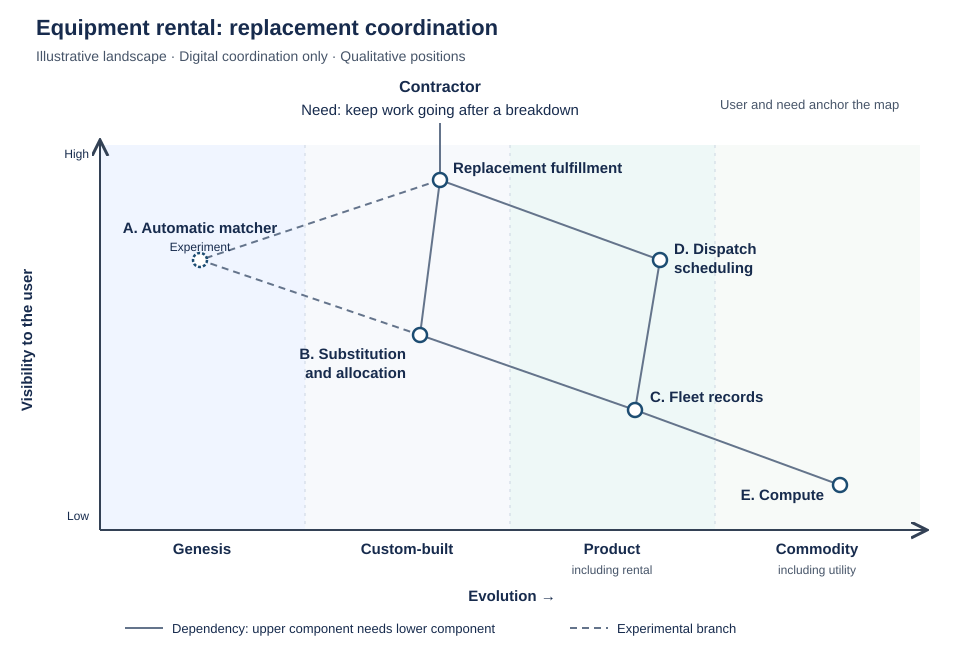
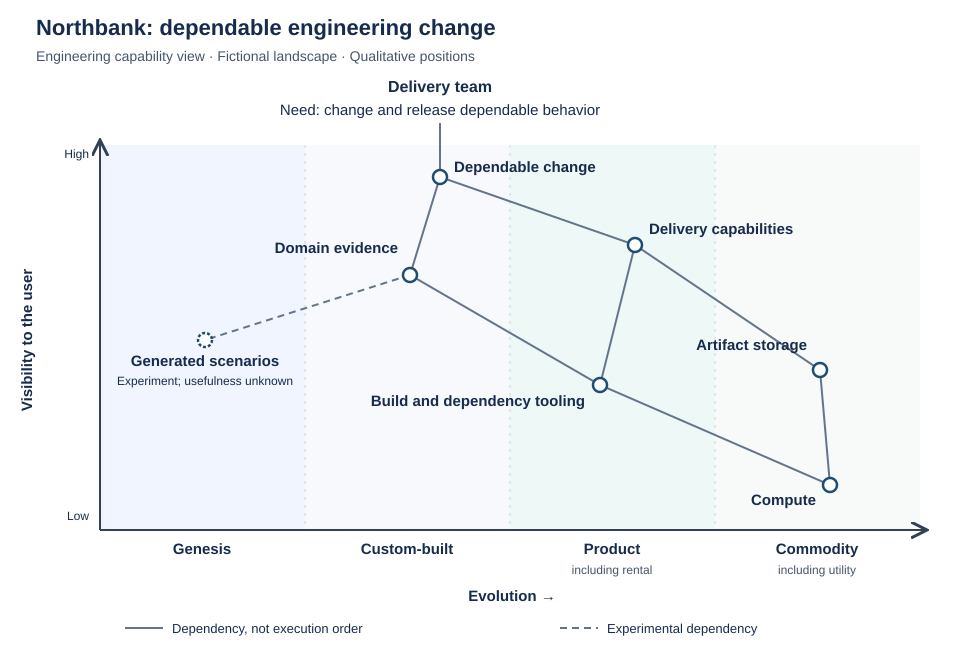

# Wardley mapping

Wardley mapping connects user needs and dependencies to the evolution of
components from novel and uncertain to widespread and standardized. It makes
choices about investment, sourcing, and organization discussable on a shared
model of the landscape.[^map][^cycle]

The fictional rental example and product-engineering connections are this
bundle's synthesis. The concepts and tables come from Simon Wardley's *Wardley
Maps*, in the December 2020 EPUB. Explaining the approach does not prescribe
adopting its full doctrine or organizational model.

## Purpose, landscape, and strategic choice

A rental company aiming to keep projects moving could improve substitution,
expand its fleet, or connect partner depots. Purpose alone does not choose
between them. Wardley distinguishes why a purpose matters from why one move
makes sense; situational awareness informs the latter.[^cycle]

### The strategy cycle

The cycle connects **purpose** (why act), **landscape** (the situation),
**climate** (forces changing it), **doctrine** (generally useful principles),
and **leadership** (judgment and action). Consequences and new knowledge can
change the landscape and purpose, renewing the cycle.[^cycle][^gameplay]

### Key terms for Wardley mapping

These are Wardley's definitions across environment, map grammar, and action.
*Domain* here names an evolutionary region, not a DDD domain.[^practice]

| Term | Meaning in Wardley mapping |
| --- | --- |
| Context | Our purpose and the landscape |
| Environment | The context and how it is changing |
| Situational awareness | Our level of understanding of the environment |
| Actual | The map in use |
| Domain | Uncharted vs Transitional vs Industrialised |
| Stage | Of evolution e.g. Genesis, Custom, Product, Commodity |
| Type | Activity, Practice, Data or Knowledge |
| Component | A single entity in a map |
| Anchor | The user need |
| Position | Position of a component relative to the anchor in a chain of needs |
| Need | Something a higher level system requires |
| Capability | High level needs you provide to others |
| Movement | How evolved a component is |
| Interface | Connection between components |
| Flow | Transfer of money, risk & information between components |
| Climate | Rules of the game, patterns that are applied across contexts |
| Doctrine | Approaches which can be applied regardless of context |
| Strategy | A context specific approach |

## Reading a Wardley map

Name whose need anchors the map: a customer's, a colleague's, or another
party's. An internal convenience must not silently replace a customer need.
Connecting dependencies forms a **value chain**, often a branching network;
it describes support for the need, not task order or monetary value.[^map][^flow]

### Position, movement, and flow

The vertical axis expresses visibility to the user, not importance; a distant
dependency may be indispensable. The horizontal axis expresses evolution, so
moving a component claims changed characteristics. Position cannot be altered
purely for visual convenience. Dependency, flow, and evolution differ: faster
information flow alone does not establish evolution.[^map][^flow]

### An equipment-rental example

[Northbank Equipment](../../northbank-equipment.md) competes on fulfilling
bookings despite breakdowns or demand changes. This map scopes digital
coordination of replacement equipment to keep work going.

Solid lines are dependencies; the dashed branch is experimental. The user and
need anchor the map without an evolution score. Equipment, inspections,
transport, and people are omitted; an analysis of physical capacity or
whole-business fulfillment must include them.

## Understanding evolution

### Component types and stages

Stage vocabulary depends on component type; Wardley uses activity labels on
the axis while distinguishing practices, data, and knowledge.[^map]

| Type | I | II | III | IV |
| --- | --- | --- | --- | --- |
| Activities | Genesis | Custom | Product + Rental Services | Commodity + Utility Services |
| Practices | Novel | Emerging | Good | Best |
| Data | Unmodelled | Divergent | Convergent | Modelled |
| Knowledge | Concept | Hypothesis | Theory | Accepted |

For activities, genesis explores uncertain possibilities, custom work adapts,
products become repeatable, and commodities emphasize dependable scale.
Differentiation and industrial innovation remain possible. *Best* and *accepted*
are Wardley's stage labels, not guarantees of suitability or truth.[^map][^doctrine]

### Evidence for placement

Placement needs a defined component and relevant environment. Evidence includes
common use, understood purpose, expected interfaces, normal tailoring, and
whether suppliers compete through novel features or dependable provision.
An internally built system may recreate a standard market capability; buying
an experimental service does not make it well understood.[^map][^synthesis]

Under the rental example's invented conditions:

| Component | Assumed evidence and placement |
| --- | --- |
| A. Automatic matcher | Usefulness under unusual site constraints is undiscovered: genesis |
| B. Substitution and allocation | Experts and tailored software manage changing, distinctive commitments: custom-built |
| C. Fleet records | Established offerings support familiar inventory and status functions: product |
| D. Dispatch scheduling | Repeatable capabilities exist with meaningful feature differences: product |
| E. Compute | Standardized provision and understood interfaces are available at scale: commodity/utility |

A's novelty concerns usefulness, not just a new algorithm. B may need splitting
if standardized reservations and custom substitution judgment are being conflated.

### Evolution, diffusion, time, and importance

Diffusion spreads an innovation; evolution changes characteristics across
successive forms. Product adoption does not establish a utility transition or
its early adopters. Position cannot be converted into years until commodity:
evolution has no direct time scale.[^evolution]

Direction can be more predictable than timing, and survival is not guaranteed.
Evolution also differs from organizational competence and business importance:
a capable team can explore a novel activity, while a commodity compute outage
can halt replacement coordination. Standardization changes the case for custom
development without removing continuity obligations.[^climate][^anticipation]

## Climate: understanding a changing landscape

Climatic patterns affect the landscape regardless of one organization's wishes,
although an organization may influence their rate or exploit their consequences.
Wardley's central pattern is evolution through supply and demand competition,
conditional on competitive pressure and survival.[^climate]

### Climatic patterns

Wardley groups economic patterns by their main influence. These are claims to
investigate and refine, not independently verified laws.[^climate]

| Category | Pattern |
| --- | --- |
| Components | Everything evolves through supply and demand competition |
| Components | Rates of evolution can vary by ecosystem (e.g. consumer vs industrial) |
| Components | Characteristics change as components evolve (Salaman & Storey) |
| Components | No choice over evolution (Red Queen) |
| Components | No single method fits all (e.g. in development or purchasing) |
| Components | Components can co-evolve (e.g. practice with activity) |
| Components | Evolution consists of multiple waves of diffusion with many chasms. |
| Financial | Higher order systems create new sources of value |
| Financial | Efficiency does not mean a reduced spend (Jevon's Paradox) |
| Financial | Capital flows to new areas of value |
| Financial | Creative Destruction (Joseph Schumpeter) |
| Financial | Future value is inversely proportional to the certainty we have over it. |
| Financial | Evolution to higher order systems results in increasing local order and energy consumption |
| Speed | Efficiency enables innovation |
| Speed | Evolution of communication mechanisms can increase the speed of evolution overall and the diffusion of a single example of change |
| Speed | Increased stability of lower order systems increases agility & speed of re-combination |
| Speed | Change is not always linear (discontinuous & exponential change exists) |
| Speed | Shifts from product to utility tend to demonstrate a punctuated equilibrium |
| Inertia | Success breeds inertia |
| Inertia | Inertia can kill an organisation |
| Inertia | Inertia increases the more successful the past model is |
| Competitors | Competitors actions will change the game |
| Competitors | Most competitors have poor situational awareness |
| Prediction | Not everything is random (p[what] vs p[when]) |
| Prediction | Economy has cycles (peace, war and wonder) |
| Prediction | Two different forms of disruption (predictable vs non-predictable) |
| Prediction | A “war” (point of industrialisation) causes organisations to evolve |
| Prediction | You cannot measure evolution over time or adoption, you need to embrace uncertainty. |
| Prediction | Evolution consists of multiple diffusion curves |
| Prediction | The less evolved something is then the more uncertain it becomes |

### Why no single method fits all

Changing component characteristics alter which methods fit. In Wardley's
account, uncertainty favors reducing the cost of change, transitional work
emphasizes learning and waste reduction, and industrialized provision favors
reducing deviation. The same principle reaches purchasing and budgeting,
not just development.[^climate]

| Method / sourcing label | Where the figure shows stronger emphasis | Where it shows weaker emphasis | Stated focus |
| --- | --- | --- | --- |
| AGILE / In-house | Toward the uncharted end | Progressively toward the industrialised end | focus on reducing cost of change |
| LEAN / Off the shelf product | Around the product region | Toward both ends | focus on learning & reducing waste |
| SIX SIGMA / Outsource | Toward the industrialised end | Progressively toward the uncharted end | focus on reducing deviation |

These qualitative tendencies express continuous gradients, not scores or fixed
boundaries. All compare evolution; their vertical stacking in the source does
not assign methods by visibility. Method/sourcing pairings do not settle an
individual sourcing decision.

### Co-evolution, inertia, and the rental landscape

Industrialized components enable new activities and related practices:
on-demand compute changes feasible operations. This is **co-evolution**.
**Inertia** resists change through past success, revenue models, skills, and
established operations.[^climate][^anticipation][^gameplay]

Suppose dependable fleet-state utilities emerge. This hypothetical change
moves C toward commodity even if its local implementation stays unchanged.
Cheaper coordination does not standardize promises or make substitutions safe.
Resistance may reflect attachment to local software or a real loss of inspection
evidence; those explanations need different responses.

What, when, and who carry different uncertainties. A clearer fleet interface
may help under several futures; selecting a provider needs additional evidence.
The map directs investigation, not a migration date.[^anticipation]

## Doctrine: principles for operating effectively

Doctrine concerns beliefs about useful actions that an organization can choose
to apply. Wardley distinguishes these from climatic patterns that act upon it.
He treats doctrine as improvable and groups it by its principal organizational
influence.[^doctrine]

### Operating principles

The complete introductory catalog includes communication, development,
operation, structure, learning, and leading.[^doctrine]

| Category | Doctrine |
| --- | --- |
| Communication | Be transparent |
| Communication | Focus on high situational awareness (understand what is being considered) |
| Communication | Use a common language (necessary for collaboration) |
| Communication | Challenge assumptions (speak up and question) |
| Development | Know your users (e.g. customers, shareholders, regulators, staff) |
| Development | Focus on user needs |
| Development | Think fast, inexpensive, simple and tiny |
| Development | Remove bias and duplication |
| Development | Use appropriate methods (e.g. agile vs lean vs six sigma) |
| Development | Focus on the outcome not a contract (e.g. worth based development) |
| Development | Be pragmatic (it doesn't matter if the cat is black or white as long as it catches mice) |
| Development | Use standards where appropriate |
| Development | Use appropriate tools (e.g. mapping, financial models) |
| Operation | Manage inertia (e.g. existing practice, political capital, previous investment) |
| Operation | Optimise flow (remove bottlenecks) |
| Operation | Think small (as in know the details) |
| Operation | Effectiveness over efficiency |
| Operation | Do better with less (continual improvement) |
| Operation | Set exceptional standards (great is just not good enough) |
| Structure | Provide purpose, mastery & autonomy |
| Structure | Think small (as in teams) |
| Structure | Distribute power and decision making |
| Structure | Think aptitude and attitude |
| Structure | Design for constant evolution |
| Structure | There is no one culture (e.g. pioneers, settlers and town planners) |
| Structure | Seek the best |
| Learning | Use a systematic mechanism of learning |
| Learning | Learn by playing the game (a bias towards action) |
| Learning | Be curious and take appropriate risks (a bias towards the new) |
| Learning | Listen to your ecosystems (acts as future sensing engines) |
| Leading | Be the owner (take responsibility) |
| Leading | Move fast (an imperfect plan executed today is better than a perfect plan executed tomorrow) |
| Leading | Think big (inspire others, provide direction) |
| Leading | Strategy is iterative not linear (fast reactive cycles) |
| Leading | Strategy is complex (there will be uncertainty) |
| Leading | Commit to the direction, be adaptive along the path (crossing the river by feeling the stones) |
| Leading | There is no core (everything is transient) |
| Leading | Be humble (listen, be selfless, have fortitude) |

Transparency needs challenge: depot staff questioning whether "recorded as
available" means "ready to dispatch" can change both the model and investment.

### Applying appropriate methods and sourcing

The climatic observation that [no single method fits all](#why-no-single-method-fits-all)
motivates using appropriate methods: matching experiments need usefulness and
error evidence; compute provision needs dependable service.[^doctrine]

Contracts for discovery and stable provision create different obligations.
Fixed specifications cannot eliminate uncertainty about what works; one
arrangement for an entire system can turn learning into change disputes.
Buying specialist experimentation or waiting for a market to develop can also
be reasonable. Build/buy depends on competence, economics, control,
integration, and suppliers.[^doctrine][^synthesis]

### Pioneers, settlers, and town planners

Wardley's organizational model connects different orientations to evolution:
[^doctrine]

| Orientation | Contribution |
| --- | --- |
| Pioneers | Explore uncertain possibilities and discover what works |
| Settlers | Turn emerging successes into useful, repeatable offerings |
| Town planners | Industrialize established capabilities for dependable scale |

Industrialized components enable exploration; successful patterns become
products and may later be industrialized. All three orientations require skill
and innovation. Pioneers operate what they build, and people can change their
orientation. A small team can vary working conditions without creating three
departments.[^doctrine]

## Gameplay: choosing contextual moves

Gameplay concerns action suited to a particular landscape and purpose. A move
needs a causal account of what changes, why that helps, the capabilities needed,
and possible responses. A map informs the choice without making it.[^gameplay]

Open source and open data can accelerate competition and evolution. Making a
dependency more widely available may benefit a company competing above it,
but rivals can use it too. An incumbent's attachment to an old revenue model
may create an opening without proving an entrant can exploit it.[^gameplay]

In **ILC—innovate, leverage, commoditize**, a provider offers industrialized
components for others to experiment on, observes emerging patterns through
platform use, and develops selected patterns into further services. Absorbing
a successful complement can harm participants, so the provider must sustain
the ecosystem as well as industrialize. An API alone does not establish the
incentives, participation, or ability to act that the play needs.[^gameplay]

For the rental company, credible fleet utilities still leave several moves:

| Move | Why it might help | What could defeat it |
| --- | --- | --- |
| Consume fleet services; invest in substitution | Reduce undifferentiated work and improve exception handling | Lost evidence needed for commitments |
| Standardize partner interfaces | Improve access to replacement equipment | Weak incentives to share records or honor reservations |
| Experiment with automatic matching | Discover better recovery decisions | Stock or transport is the real bottleneck |
| Maintain the current arrangement while investigating | Preserve service while uncertainty is resolved | Delay consumes capacity or lets a competing network establish itself |

The map locates what changes. Demand, migration cost, incentives, and depot
capacity still need evidence; changed evidence can justify a different move.

## Mapping as a learning practice

Wardley teaches repeated passes through the strategy cycle: maps expose
assumptions, action provides evidence, and reflection changes the next move.
Trying to map everything before learning can delay that benefit.[^practice]

### Distinguishing climate, doctrine, and gameplay

The following comparison recaps patterns introduced through a first pass.
Its columns are independent lists, not matched rules. It connects learning
about the environment, developing the organization, and choosing action.
[^practice]

| Climatic (rules of the game) | Doctrine (universal actions you should take) | Gameplay (context specific actions you could take) |
| --- | --- | --- |
| Everything evolves | Focus on user need | Accelerator (open source) |
| Characteristics change | Use a common language | De-accelerator (ringfencing with patents) |
| No one size fits all | Be transparent | Exploiting constraint |
| Efficiency enables innovation | Challenge assumptions | ILC (ecosystem model) |
| Higher order systems create new sources of worth | Remove duplication and bias | |
| No choice on evolution | Use appropriate methods | |
| Past success breeds inertia | Think small | |
| | Think aptitude and attitude | |
| | Design for constant evolution | |
| | Enable purpose, autonomy and mastery | |

For example, evolving fleet provision is a climatic change; choosing methods
appropriate to components applies doctrine; opening a partner interface is a
contextual move. Confusing these categories turns an observation about the
market into an unjustified prescription.

### Reflecting on situational awareness

Wardley uses organizational anti-patterns to support discussion and reflection.
These contrasts are his guide to examining behavior, not a calibrated score or
proof that a particular artifact establishes understanding.[^practice]

| Higher levels of situational awareness | Indicator of … | Lower levels of situational awareness |
| --- | --- | --- |
| Visual (maps) | Navigation | Verbal (story telling) |
| Action & reflection | Learning | Secrets of success |
| Position and movement | Strategy | Magic thinking (SWOTs, 2x2s) |
| Where before why | Order | Tyranny of action (how, what and when) |
| Detailed | Landscape | Vague |
| Context specific & universal | Patterns | Universal memes |
| Aptitude and attitude | Organisation | Functional or business silos |
| Thinks small | Granularity | Thinks big |
| Mixed (agile + lean + six sigma) | Methods | Single (all agile etc) |
| Known | Duplication and bias | Unable to quantify |
| Embraced | Challenge | Defended against |
| Essential | Transparency | Resisted |
| Common | Language | Tribal factions |
| User needs | Anchor | Own needs |

Granularity should expose the decision: "IT" hides differences, while every
function call can bury them. Distinguish current state, anticipated change,
and desired intervention. Fleet integration tests may expose missing allocation
evidence; matching experiments may reveal transport constraints. Return those
findings to the map and strategy cycle.[^practice]

## A second view: the engineering system

Northbank's delivery team needs to change and release dependable behavior.
That user and need anchor a different map from the contractor view. Domain
verification, build, package enforcement, artifact storage, deployment,
telemetry, and recovery form dependencies of that engineering capability.

Positions are fictional hypotheses about the selected components. The dashed
scenario-generation experiment has unproven usefulness; it is not required
Northbank functionality. Existing
custom boundary code may recreate an established product capability; its
implementation language or location does not make the underlying need novel.
Conversely, a tool's existence does not establish coverage of Northbank's rules.
The [worked engineering change](../../engineering/northbank-engineering-system.md)
compares mechanisms, demonstrates their obligations, and retains uncovered
custom behavior before retiring obsolete machinery. Its module, task, and
deployment views have different meanings from this landscape.

## Relationships to product engineering

For the connection to value, advantage, and team focus, read [Strategy perspectives and their relationships](../strategy-perspectives.md).
The [lifecycle map](../../index.md#the-seven-lifecycle-sections) locates the
practical decisions; mapping supplies context and does not settle their evidence.

[Jobs to Be Done](../jobs-to-be-done.md) can correct the need anchoring a map.
A functional-job map decomposes what someone seeks to accomplish; a Wardley
map positions dependencies by evolution. Neither substitutes for the other.

[DDD](../domain-driven-design.md) distinguishes a capability's strategic role
through subdomain classification and consistent model meaning through bounded
contexts. Neither is its evolution stage. A core subdomain can combine familiar
components; a generic subdomain may have an unnecessarily custom implementation.
Standardizing fleet records does not make "available to promise" and "inspected
and ready to leave" identical or settle model and deployment boundaries.

## Applicability, limits, and further reading

Mapping is useful when dependencies, differing uncertainty, or changing
provision matter to a decision. Otherwise its effort may be unjustified.
Wardley's cases and this illustrative scenario do not prove effectiveness
across organizations.[^book][^practice]

Positions are judgments, evolution is not a calendar, and commodities retain
operating obligations. "Build the left, buy the right" cannot replace sourcing
evidence. A map still needs action and a rationale open to revision.

The [ebook directory](https://learnwardleymapping.com/book/) supplies the book
and public chapter links.[^book]

- Chapters 1–2 establish the strategy cycle and map grammar; 3–5 develop
  climate, doctrine, and gameplay; 6 connects these through practice and learning.
- Chapters 7–9 deepen evolution, flows, and anticipation; chapter 11 expands
  the catalogs and discusses sourcing pitfalls.
- Chapters 12–14 offer further scenarios, followed by scenario planning in 15.

Adapted from Simon Wardley's *Wardley Maps*, under
[CC BY-SA 4.0](https://creativecommons.org/licenses/by-sa/4.0/), the same license
as this bundle. The reviewed edition is the December 2020 EPUB compiled by
Ben Mosior. The tables retain the selected source entries and qualifications;
method suitability is a textual interpretation. Source color marking prior
chapter coverage is omitted. Prose, arrangement, and the rental example are
adaptations. Citations identify the corresponding public originals, not a
claim to have reviewed every later revision.

## Continue exploring

- [Playing to Win](../playing-to-win.md) examines whether the arena, advantage,
  capabilities, and systems behind a proposed move reinforce one another.
- [Maintenance](../../maintenance/maintenance-and-the-life-of-software-products.md)
  adds existing-product knowledge and the responsibilities of intervention.
- The [strategic choices](../../reading-product-engineering.md#strategic-choices)
  and [continuity and change](../../reading-product-engineering.md#continuity-and-change)
  routes connect this landscape perspective to practical decisions.

[^cycle]: Simon Wardley, *Wardley Maps*, chapter 1, On being lost.
[^map]: Simon Wardley, *Wardley Maps*, chapter 2, Finding a path; component types and stages in figure 10.
[^climate]: Simon Wardley, *Wardley Maps*, chapter 3, Exploring the map; method suitability and climatic patterns in figures 22 and 27.
[^doctrine]: Simon Wardley, *Wardley Maps*, chapter 4, Doctrine; introductory principles in figure 44.
[^gameplay]: Simon Wardley, *Wardley Maps*, chapter 5, The play and a decision to act.
[^practice]: Simon Wardley, *Wardley Maps*, chapter 6, Getting started; key terms, learning recap, and reflection contrasts in figures 60, 64, and 66.
[^evolution]: Simon Wardley, *Wardley Maps*, chapter 7, Finding a new purpose.
[^flow]: Simon Wardley, *Wardley Maps*, chapter 8, Keeping the wolves at bay.
[^anticipation]: Simon Wardley, *Wardley Maps*, chapter 9, Charting the future.
[^synthesis]: Simon Wardley, *Wardley Maps*, chapter 11, A smorgasbord of the slightly useful.
[^book]: Learn Wardley Mapping, Wardley Maps ebook and chapter directory; compiler attribution also appears in the reviewed EPUB's front matter.
