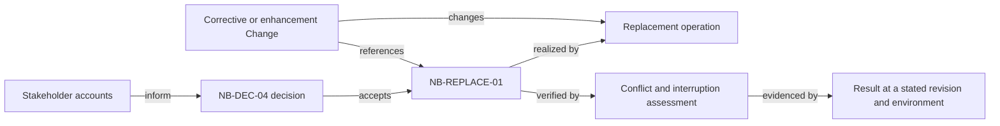

# Northbank commitments: requirements, witnesses, and change

[Northbank Equipment](../../../northbank-equipment.md) wants dependable rentals,
but that aspiration leaves decisions open. In episode D, it considers replacing
an assigned machine without breaking the customer's agreement. This fictional
example follows a few obligations through disagreement, acceptance, realization,
and revision. It is not a complete rental specification.

## Begin with conflicting sources

| Source account | Candidate implication | Unresolved decision |
| --- | --- | --- |
| Contractor: “I need the agreed capability when the crew arrives” | Some substitutions may preserve the purchase | Which constraints are mandatory, and who can accept changes? |
| Sales: “Any better machine is an upgrade” | Staff could substitute without asking | Better on which dimension? Size, power, access, or operator needs may differ |
| Depot: “Keep the old assignment until the replacement is secured” | Failure must preserve allocation state | What does preservation mean if the original machine has broken? |
| Integration owner: “The fleet API has fresh availability” | Software confirmation may be feasible | Can all competing writers be controlled, or is this only a read? |

These accounts inform candidates. None becomes authoritative because a team
has written a test or opened a Change. In the story, product and depot leaders
accept the selected rules after reviewing scenarios and feasibility. Engineering
chooses mechanisms within them. [Resolving conflicts](../development/resolving-conflicts-and-open-decisions.md)
explains how to preserve the competing claims and decision evidence.

## Declare the accepted scope

For this specimen, the decision `NB-DEC-04` accepts single-line reservations
for Northbank-owned assets in the controlled Central-depot allocation scope.
Existing named-machine agreements retain their original terms. Automated
partner reservations and multi-machine atomic replacement remain outside this
decision. These are fictional accepted states, not real approvals.

This document is the authoritative wording location for the following
specimen identities. Code, executable examples, work items, and results are
witnesses. In a real host, the same relationship could use native records.
[One authority, many witnesses](../foundations/one-authority-many-witnesses.md)
governs the distinction.

| Identity | Accepted obligation | Conditions and observation |
| --- | --- | --- |
| `NB-ALLOC-01` | Within the controlled allocation scope, an asset shall have no overlapping active allocations or unexpired holds | Scheduling uses half-open intervals; a hold counts until its expiry instant; inspect committed outcomes of competing commands |
| `NB-SUB-01` | An authorized replacement shall preserve reservation identity, agreed period, price, and every agreed capability constraint | A candidate outside those terms needs a new customer decision; the accepted terms are versioned with the reservation |
| `NB-REPLACE-01` | Replacement shall either secure the new allocation and update the assignment together, or preserve the prior assignment and allocation state | Applies to failed validation, concurrency conflicts, and interrupted persistence; preserving state does not assert that the former machine remains usable |
| `NB-REPLAY-01` | Repeating a replacement operation with the same identity and inputs shall return its recorded outcome without a second business effect | For this specimen, identities/results persist for the reservation lifetime and 30 days after terminal closure; changed inputs under that identity are rejected; older retries require reconciliation |
| `NB-RECEIPT-01` | Replaying receipt rendering shall not initiate another charge | The renderer consumes committed Billing data; financial mutation is outside its authority |
| `NB-MIGRATE-01` | Migration shall preserve existing customer terms and establish one allocation writer before admitting new replacement commands for a migrated cohort | Ambiguous legacy records require explicit resolution; old writers cannot allocate the same controlled inventory outside the new protection |

The retry-retention period is an invented decision for this exhibit. It is not
an industry recommendation. A real selection would need the retry, support,
storage, and retention circumstances. Likewise, capability constraints are
agreed inputs, not engineering advice about safe equipment substitutions.

## Choose a form that exposes the uncertainty

The obligations above are compact prose. A decision table helps examine
`NB-SUB-01` without embedding its implementation:

| Candidate and request | Replacement decision |
| --- | --- |
| Required attributes satisfied, agreed period/price unchanged, actor authorized | Eligible for allocation attempt; capacity still has to be secured |
| More capacity but incompatible site access | Reject under existing terms; “upgrade” does not settle admissibility |
| Compatible machine but another commitment occupies the period | No replacement under this attempt |
| Same request repeated after a successful commit | Return recorded outcome within the accepted replay scope |
| Original machine has broken and no replacement is secured | Preserve truthful allocation history; mark fulfillment at risk and follow recovery policy |

An executable witness might read:

```text
Witness of NB-REPLACE-01, revision 1:
Given reservation R-42 is assigned to asset A for its agreed period
and asset B cannot be secured for that period,
when an authorized dispatcher requests replacement with B,
then the attempt reports the conflict
and R-42 has no newly committed assignment to B.
```

This witness illustrates one failure path; it is not the full rule or proof of
all concurrency behavior. The [allocation change](../../../engineering/northbank-allocation-change.md)
selects technical mechanisms and evidence. It does not silently take ownership
of the requirement text.

For a quality obligation, use the separate
[confirmation-read service-level example](../../../foundations/service-level-indicators-objectives-and-agreements.md).
Its two-second condition, authorized client boundary, 28-day window, and
unknown-event treatment must accompany a proposed target. Selecting an SLO
as a KPI does not itself accept that target as a requirement.

For external conformance, a fictional provider contract `Fleet API v2`, clause
`reservation-outcome`, could require the client to distinguish confirmed,
declined, and unknown outcomes. Name that local fixture and version; do not
substitute “comply with all standards” or imply an actual provider contract.

## Trace the obligation across artifacts



The assessment defines what would establish the condition. A result records
what happened for particular inputs, revision, and environment. The Change
coordinates work; implementation or closure cannot accept a new obligation.
A characterization test of the old `available` Boolean is evidence of legacy
behavior, not an acceptance decision.

## A later change reopens the scope

Suppose Northbank wants a partner asset as the replacement. The local atomic
transaction cannot include an independent provider's decision. The proposal
now needs hold/expiry behavior, unknown-outcome recovery, user-visible pending
states, and a decision on how long uncertainty is tolerable. Those fields
remain candidate until decided; an author must not invent a convenient timeout.

Impact analysis reaches customer terms, provider contracts, allocation
ownership, schemas, command states, tests, telemetry, staff procedure, release
sequencing, and the project's forecast. Keep the old obligation and its
evidence identifiable. A proposed revision does not retroactively turn the
old local-store test into proof of partner coordination.

Follow [Analyzing and specifying requirement change](../lifecycle/analyzing-requirement-impact.md)
for that work, or [Selecting a specification method](selecting-a-specification-method.md)
when the next uncertainty needs a state model or a different representation.
