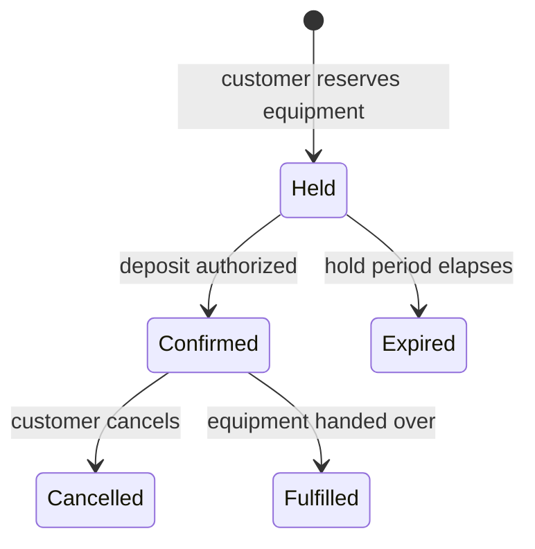

# Entity Type template

Use for one kind of thing in the business domain that has identity and about
which the system keeps data, such as a reservation, a customer, or an equipment
item. Apply the [Spec profile](../references/profile.md). The Type contract is
normative; the remaining sections guide authoring.

## Type contract

- **ET-1** The title MUST name the kind of thing as a singular noun phrase,
  such as "Reservation" or "Equipment item".
- **ET-2** An Entity Type document MUST include these sections:
  - **Definition**: what one instance is, following the profile's
    [definition rules](../references/profile.md#definitions).
  - **Identity**: what makes an instance the same instance over time, and
    different from every other, in business terms.
  - **Attributes**: each data attribute kept about an instance, with its
    definition, representation, and whether it is required.
  - **Relationships** *(optional)*: each relationship to another entity type,
    with its meaning.
  - **Lifecycle** *(optional)*: the states of an instance and their
    transitions.
  - **Invariants** *(optional)*: the invariants of the entity type.
- **ET-3** Each relationship between two entity types MUST be stated in the
  **Relationships** of only one of them, with the cardinality of both sides.
- **ET-4** **Lifecycle** MUST state every permitted transition and that no
  other transition is permitted.

## Suggested document

```markdown
---
type: Entity Type
title: <Singular noun phrase>
description: <What one instance is, in one sentence>
status: draft
---

# <Singular noun phrase>

## Definition

<A phrase naming the broader kind of thing and what distinguishes it.>

## Identity

<What makes an instance the same instance over time, and different from every other.>

## Attributes

| Attribute | Definition | Representation | Required |
| --- | --- | --- | --- |
| <Name> | <What it is> | <[<Value type>](<link>), or a kind with allowed values, range, units, or precision> | <Yes \| No \| Condition> |

## Relationships

| Relationship | Entity type | Each <this entity type> relates to | Each <other entity type> relates to | Meaning |
| --- | --- | --- | --- | --- |
| <Verb phrase> | [<Entity type>](<link>) | <Exactly one \| Zero or one \| One or more \| Zero or more> | <Exactly one \| Zero or one \| One or more \| Zero or more> | <What the relationship means> |

## Lifecycle

<A state diagram of every permitted transition, each labeled with the event that causes it, and a statement that no other transition is permitted.>

## Invariants
## Illustrations
## Open questions
## Related
```

## Writing guidance

### Definition

The **Definition** is the only definition of the entity type's name, as
[defined names](../references/profile.md#defined-names) requires. Link the
terms it uses:

~~~markdown
## Definition

A customer's commitment to rent specified equipment from a [depot](<link>)
for one [rental period](<link>).
~~~

### Identity

Identity says what sameness means for an instance, not how the system stores
it. It may rest on a business identifier, such as the manufacturer serial
number that identifies an equipment item, or on continuity, such as a customer
who remains the same customer when their email address changes. Two instances
with identical attributes may still be different instances. An identifier that
the system generates belongs here only when the business uses it.

When two things with equal attributes are interchangeable, they are values,
described by a [Value Type](value-type.md), not instances.

### Attributes

| Column | Content |
| --- | --- |
| Attribute | The name the business uses, in the singular. |
| Definition | What the attribute is, following the definition rules. |
| Representation | A link to the Value Type, or the business representation: a kind such as text, whole number, decimal, date, date and time, duration, or yes/no, with allowed values, range, units, or precision. |
| Required | Yes, No, or the condition under which a value is required. |

For a customer, the email address is an [Email address](<link>), and the
date of birth is kept for a person to apply [Minimum renter age](<link>). Link
where an attribute's value comes from, such as the condition that
[Equipment telematics](<link>) reports, under **Related**.

A length or format belongs in the representation only as
[work management and design](../references/profile.md#work-management-and-design)
allows: the 8-character reservation number that customers quote to depots is
used by the business, and the 12-character serial number is set by the
manufacturer.

### Relationships

State a one-to-many relationship in the entity type on the many side, and
any other in whichever entity type readers look to first. For a reservation
made by one customer, the Reservation document states "is made by |
[Customer](<link>) | Exactly one | Zero or more", and the Customer document
does not repeat it.

Cardinality states what the data allows. A policy that limits it further is
placed by
[invariant, business rule, or requirement](../references/modules/data.md#invariant-business-rule-or-requirement).

### Lifecycle

**Lifecycle** holds the states of an instance, its permitted transitions,
what creates an instance, and whether an ended instance is removed, retained,
or anonymized. A state diagram is often the clearest form. Label each
transition with the event that causes it, in business terms, and for linking
the use cases and business rules that cause transitions, follow
[Not yet defined](../references/modules/data.md#not-yet-defined).

~~~markdown
## Lifecycle

A reservation passes only through the states and transitions that the
following diagram defines; no other transition is permitted. A reservation is
retained after it ends.


~~~

What the system does when a transition occurs, or is attempted without being
permitted, is placed by
[where content goes](../references/modules/data.md#where-content-goes).

### Invariants

State conditions that every instance satisfies across its attributes and
relationships because of what the data means, such as "A reservation's
cancellation time is not earlier than its confirmation time."

### Illustrations

Sample instances and entity relationship diagrams help readers but do not
define the data. Draw relationship diagrams as Mermaid `erDiagram`.

### Related

Link the value types, business rules, and external interfaces the entity type
is about, and the use cases that cause its lifecycle transitions, beyond those
linked in its sections, including the rules that set how long its data is kept
and who may see them, such as [Customer data retention](<link>). Use cases and requirements that create,
read, change, or end instances link here from their own **Related**. Record
undecided attributes, identity, relationships, or transitions under
**Open questions**.
