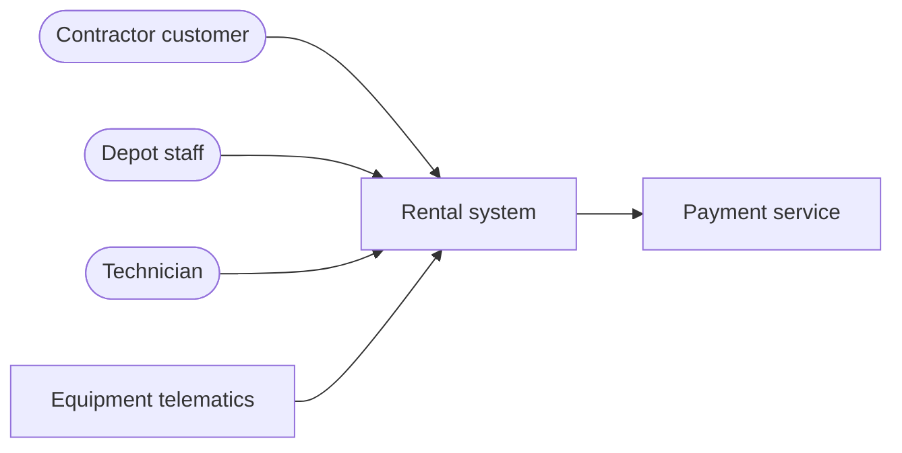

# System template

Use for the system being specified: what it is, where its boundary lies, and
the conditions it must work in. Apply the
[Spec profile](../references/profile.md). The Type contract is normative; the
remaining sections guide authoring.

## Type contract

- **SYS-1** The title MUST be the system's name.
- **SYS-2** A System document MUST include these sections:
  - **Purpose**: what the system is and does.
  - **Boundary and context**: what is inside the system and what is outside
    it, naming each party the system interacts with.
  - **Operating environment** *(optional)*: conditions the system must work
    in.
  - **Quality priorities** *(optional)*: which qualities matter most, and
    what gives way when they conflict.
- **SYS-3** **Boundary and context** MUST link each party to its User Class or
  External Interface.

## Suggested document

```markdown
---
type: System
title: <System name>
description: <What the system is and who it serves, in one sentence>
status: draft
---

# <System name>

## Purpose
## Boundary and context
## Operating environment
## Quality priorities
## Open questions
## Related
```

## Writing guidance

### Purpose

State what the system is and does in a paragraph, and whether it is new, a
replacement, or part of a larger family of products. Do not summarize the
business case; `business.md` holds it. Link features rather than
describing them; each folder's `index.md` lists them.

### Boundary and context

Show the system as one whole, surrounded by the user classes, external
systems, and devices it interacts with. For a small system, a list naming and
linking each party is enough.

A context diagram shows the system as a single element surrounded by its
parties. When it is used with the party list, it shows exactly the parties the
list names, as the profile's
[binding and illustrative content](../references/profile.md#binding-and-illustrative-content)
rules require. Do not draw the system's internal structure.

~~~markdown


- [Contractor customer](<link>)
- [Depot staff](<link>)
- [Technician](<link>)
- [Payment service](<link>)
- [Equipment telematics](<link>)
~~~

### Operating environment

Describe the conditions the system must work in, such as platforms, runtimes,
network conditions, deployment contexts, and named load conditions: the
conditions, not design choices or deployed instances.

A condition that several requirements use is named here, once, as the
profile's [shared definitions](../references/profile.md#shared-definitions)
rule requires. Define it with quantities, so that a tester could reproduce it:

```markdown
**Peak load**: 2,000 concurrent customers, 80% of them searching.
```

### Quality priorities

State which qualities matter most and what gives way when they conflict,
linking the concept that defines each one, such as "[Confidentiality](<link>) over
[availability](<link>): a reservation is refused rather than taken without an
authorized deposit."

Qualities of a quality model that were considered and deliberately left out
can be listed with the reason, so that readers can tell an exclusion from an
oversight.
